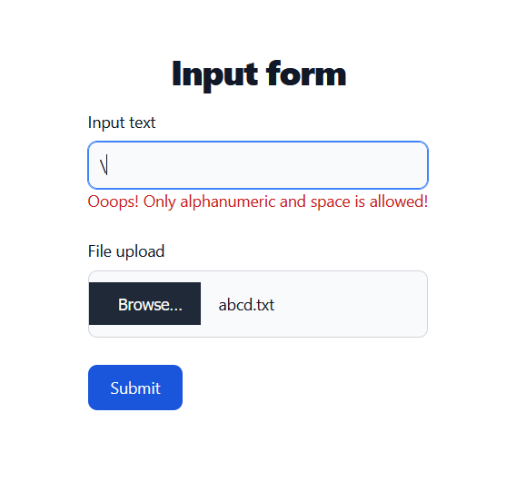

# Fovus Project
I am Keyur Desai. I have been able to tackle all the requirements, including the bonus requirements mentioned in the specification document.

##About the project

[Infrastack](infra\lib\infra-stack.js) has the aws structure. It has all the instructions to build the whole infrastructure.

I have used react hook form for validation and react router for routing.

## Installation
It works on amplify so either you can push it to your repository and configure the [config file](infra\config.js) or use from my github repository configuration itself.

After configuring config file,
1. `cd ./infra && cdk bootstrap`
2. `cdk deploy`

It'll push the portal on the amplify. But you'll have to initialize the 1st build. Afterwards on every commit it'll auto build.

Then go to the portal url provided by the amplify.

EC2 takes very long time in booting so after it has booted up use the portal otherwise you won't see the output_[input_file_name].txt .

## Authentication
User needs to sign up first. And then they'll receive the confirmation code which they have to insert to confirm the user.

After confirming the user, user needs to login to have access to the input form.

## Input form
Before submitting the main form, wait for the ec2 instance to boot up.

About form,
Input text will be appended to the file uploaded. Input file will be saved as output_[input_file_name].txt after being processed by AWS EC2.

After the form is submitted there is NO RESPONSE. But check the s3 bucket for uploaded file and dynamo db for output file column.

run `cdk destroy` from infra folder to destroy the stack.

## Screenshots

Above is the screen shot of the input form utilizing flowbite tailwind.

Above is the screenshot showcasing responsive design.

Above image shows the validation of the form, which is available on every form.